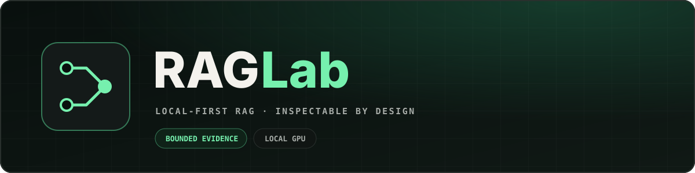
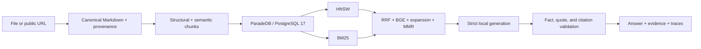
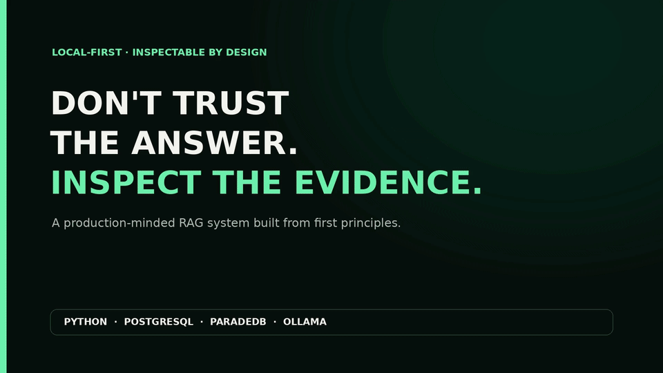

# RAGLab



RAGLab is a local-first laboratory for learning **Retrieval-Augmented Generation (RAG)** from
first principles. It keeps conversion, chunking, retrieval, generation, SQL, citations, and
evaluation visible instead of hiding them behind an orchestration framework.

[](https://github.com/FranRguezCer/RAGLab/actions/workflows/ci.yml)
[](#minimal-demo)

## What you can inspect

- **Idempotent ingestion:** local files or public URLs become canonical Markdown, structured
  chunks, 1024-dimensional Qwen embeddings, and atomically stored evidence.
- **Hybrid retrieval:** semantic HNSW and lexical BM25 results are fused with RRF, reranked with
  BGE, expanded to useful parents, and diversified with MMR.
- **Strict generation:** local Ollama models answer from retrieved evidence, while source IDs,
  quotes, entailment, and citations are validated.
- **Transparent evaluation:** retrieval and generation have separate metrics, visible case traces,
  and a local regression gate.
- **Supervised sharing:** a prepared local corpus can be exposed temporarily through a one-session
  Cloudflare Quick Tunnel.

## Architecture



Ollama runs embeddings and generation locally. PostgreSQL stores source truth, provenance, chunks,
vectors, and lexical indexes in one transactional system. Docling converts complex documents
locally; Jina Reader is available only as an explicit opt-in for public URLs.

## Quick start

Requirements: Python 3.12, Docker with Compose, and [Ollama](https://ollama.com/).

```bash
python3 -m venv .venv
source .venv/bin/activate
python -m pip install --upgrade pip
python -m pip install -e '.[dev,tokenizers,conversion,retrieval,generation]'
python -c "from transformers import AutoTokenizer; AutoTokenizer.from_pretrained('Qwen/Qwen3-Embedding-0.6B')"
hf download tasksource/deberta-small-long-nli \
  --revision 9a77395d4d3751be9e2a69c4ae318491d9b3fffb
cp env.template .env
docker compose up -d --wait
ollama pull qwen3-embedding:0.6b
ollama pull qwen3:4b
```

If Ollama is not already a system service, run `ollama serve` in another terminal. Compose exposes
PostgreSQL only on `127.0.0.1:5432`. The CLIs load the nearest `.env`; command-line flags override
environment variables, which override `.env` and built-in defaults.

Run the complete path on the tracked Aster manual:

```bash
raglab-ingest data/samples/aster_greenhouse_controller_manual.md \
  --collection greenhouse-manuals

raglab-retrieve "What causes fault E17?" \
  --collection greenhouse-manuals

raglab-generate "What causes fault E17, and how should it be resolved?" \
  --collection greenhouse-manuals
```

Ingesting the unchanged source again returns `status: "skipped"` and creates no duplicate vectors.
After pulling changes to a `raglab-*` command, refresh the editable install with
`python -m pip install -e . --no-deps`.

## Main commands

| Command | Purpose |
| --- | --- |
| `raglab-ingest SOURCE` | Convert, chunk, embed, and index one source. |
| `raglab-ingest-corpus MANIFEST --receipt PATH` | Ingest a validated local corpus manifest atomically. |
| `raglab-retrieve QUERY` | Run inspectable ANN + BM25 hybrid retrieval. |
| `raglab-generate QUERY` | Retrieve evidence and return one strictly cited JSON answer. |
| `raglab-evaluate [DATASET]` | Run dataset cases through PostgreSQL and Ollama, then score them. |
| `raglab-evaluation-gate RUN BASELINE` | Compare one evaluation run with a baseline. |
| `raglab-demo prepare` | Build and locally gate reusable demo evidence. |
| `raglab-demo share` | Open the prepared UI through a temporary tunnel. |

Use `<command> --help` for the current arguments. The [learning guide](docs/guide.md) explains the
four stages and their CLI controls.

## Minimal demo

This 14-second tour shows the local-first workflow, a cited answer, and the bounded evaluation
scorecard:



The demo uses native Ollama for GPU inference and Docker only for PostgreSQL. Run it from a clean
Git worktree because both commands reject tracked changes:

```bash
source .venv/bin/activate
raglab-demo prepare
raglab-demo share
```

Open the printed one-session HTTPS URL, inspect a query's citations and ranking trace, then press
`Ctrl-C` to stop both the local server and tunnel. `prepare` performs the six-case gate locally;
CI does not deploy the demo or publish an image. Installation, security, verification, and recovery
details are in the [operations appendix](docs/appendix.md#live-local-demo-runbook).

## Documentation

| Document | Use it for |
| --- | --- |
| [Learning guide](docs/guide.md) | Ingestion, retrieval, generation, evaluation, CLI references, notebooks, and the optional PDF exercise. |
| [Operations appendix](docs/appendix.md) | Full demo runbook, security model, testing, troubleshooting, GPU profile, and the BGE OOM incident. |

Start with the quick path above, then follow the [four-stage learning path](docs/guide.md#learning-path).
